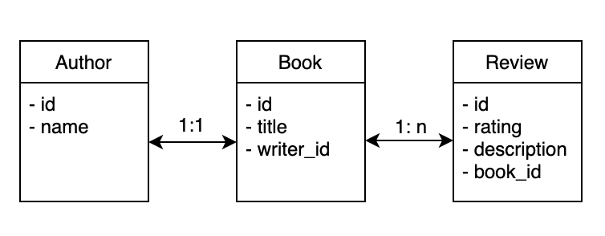

# spring-data-jpa-example
Example project implemented using Spring Boot, JPA, and Spring Data.

## Tech Stacks
- Used Java 11 and Spring Boot 2.2.0.
- Used H2 to demonstrate in-memory database.

## Description
- There are three entities: Author, Book, Review.
- Each entity is designed to demonstrate different types of relationships (1:1, 1:N, N:N in progress).
- An author is assumed to have written only one book, and a book is assumed to be written by only one author to demonstrate 1:1 relationship.
- The following diagram (not a strict URL diagram) shows the entities and the relationships between them.

